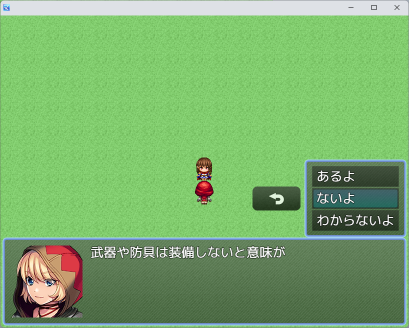
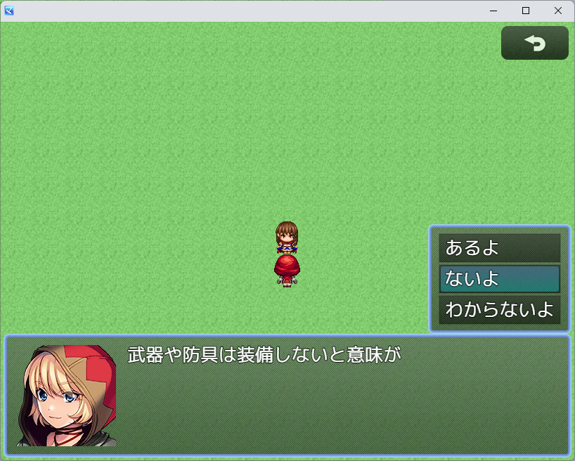
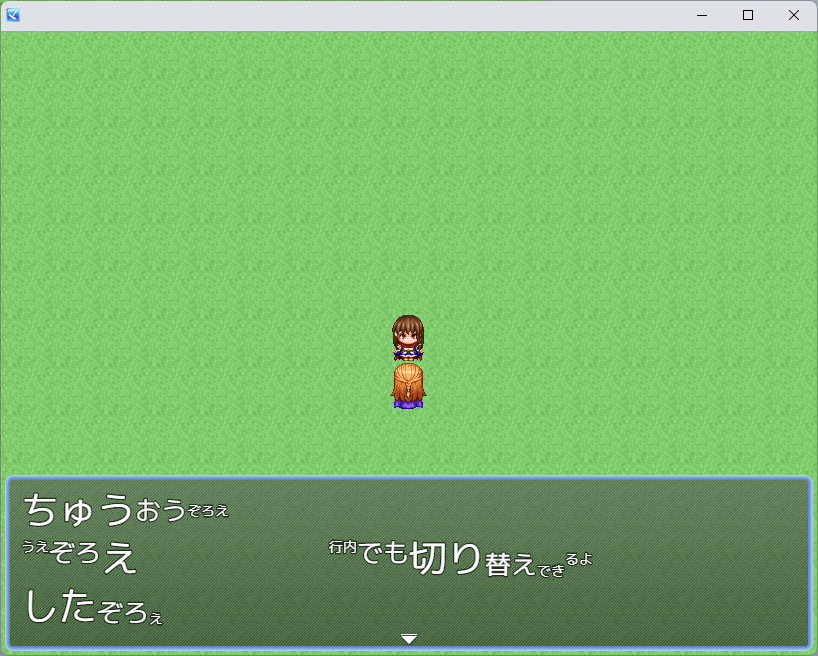

# 自作のプラグイン
一部文章生成AIを利用しています。

## プラグイン一覧

### [AutoEquipScoring.js](./AutoEquipScoring.js)
- **概要**: 最強装備の評価ポイント操作プラグイン
- **機能**:  
    - 最強装備の際に選ばれる基準になる評価ポイントを装備ごとに設定することで優先度を操作します。

##
### [CustomTouchUI.js](./CustomTouchUI.js)
- **概要**: タッチUIボタンの位置を変更するプラグイン
- **機能**:  
    - タッチUI ON時に表示されるキャンセルボタンの表示位置を変更します。
- **サンプル**:
    -  → 

##
### [DisableImageDecryption.js](./DisableImageDecryption.js)
- **概要**: 画像の復号化処理を無効化するプラグイン
- **機能**:  
    - デプロイメント時に画像を暗号化したゲームにおいて、一部の画像を暗号化されていないものとして扱います。
    - 暗号化画像と非暗号化画像両方を扱えるようになります。

##
### [FastForwardSwitch.js](./FastForwardSwitch.js)
- **概要**: 早送りスイッチプラグイン
- **機能**:  
    - 指定したスイッチがONの間、ボタン長押し早送り状態になります。

##
### [TileChange.js](./TileChange.js)
- **概要**: タイルを書き換えるプラグイン
- **機能**:  
    - マップの指定座標のタイルを書き換えます。
- **備考**:  
    - 公式プラグインPluginCommonBase.jsベース

##
### [VerticalAlignControl.js](./VerticalAlignControl.js)
- **概要**: 文章の縦方向揃えを変更するプラグイン
- **機能**:  
    - 行内の文字にサイズ差がある場合の縦方向揃えを変更します。
    - 制御文字を書き込むことで同じ行内でも揃え方向を変更できます。
- **サンプル**:
    - 

##
### [hidariue5.js](./hidariue5.js)
- **概要**: ゲーム画面をUIエリアに収めるプラグイン
- **機能**:  
    - 画面のサイズがUIエリアサイズより大きい場合に戦闘グラフィック、マップスクロール、ウィンドウをUIエリアに収めます。
- **備考**:  
    - 公式プラグインPluginCommonBase.jsベース

